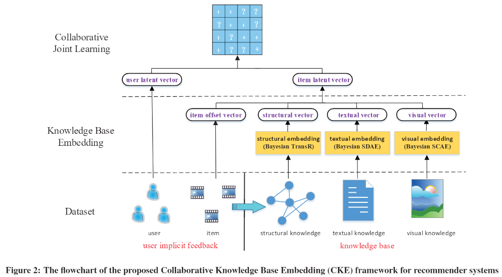

# Collaborative knowledge base embedding for recommender systems

[Collaborative knowledge base embedding for recommender systems](https://www.kdd.org/kdd2016/subtopic/view/collaborative-knowledge-base-embedding-for-recommender-systems)

# 1. Introduction

- disadvantages of CF methods:
    - limited performance when user-item interactions are very sparse
    - can not recommend new items.

➡️ hybrid recommender system: combine CF and auxiliary information such as item content

- This paper integrate CF with item's knowledge base, included:
    1. network structure information → network embedding approach to extract infomation
    2. textual content → stacked denoising auto-encoders to extract information
    3. visual content → stacked convolutional auto-encoders to extract information
- integrate CF with items' semantic representations by their framework: 
Collaborative Knowledge Base Embedding (CKE)

# 2. Preliminary

## 2.1 User Implicit Feedback

Assume there are $m$ users and $n$ items, we define the user implicit feedback matrix $\bold{R} \in \mathbb{R}^{m \times n}$.

$R_{ij}=1,$ if user $i$ and item $j$ interactions have been observed, $0$ otherwise.

## 2.2 Knowledge Base

### 2.2.1 Structural knowledge

heterogeneous network (KG)

### 2.2.2 Textual knowledge

textual knowledge, usually gives the main topics of this book or this movie.

### 2.2.3 Visual knowledge

images knowledge, such as book's front cover or as movie's poster image.

## 2.3 Problem Formulation

user-item implicit interaction + structural knowledge + textual knowledge + visual knowledge

➡️ recommend each user with a ranked list of items

# 3. Overview

CKE mainly consist of two steps:

1. knowledge base embedding
    - structural embedding: Bayesian TransR
    - textual embedding: Bayesian stacked denoising autoencoder (Bayesian SDAE)
    - visual embedding: Bayesian stacked convolutional autoencoder (Bayesian SCAE)
2. collaborative joint learning

# 4. Knowledge Base Embedding

## 4.1 Structural Embedding

- Bayesian TransR
看起來跟TransR差不多，主要在negative sampling的時候考慮 incorrect triplet 的難易度:
incorrect triplet $(v_h,r,v_t')$ 被抽到的機率: $\sigma(f_r(v_h,v_t)-f_r(v_h,v_t'))$

## 4.2 Textual Embedding

- stacked denoising autoencoders (SDAE)
bag-of-words vector做autoencoder

## 4.3 Visual Embedding

- stacked convolutional autoencoder (SCAE)

# 5. Collaborative Joint Learning

- item latent vector:
$e_j = \eta_j + v_j + X_{\frac{L_t}{2}, j*} + Z_{\frac{L_ㄒ}{2}, j*}$
- pair-wise preference probability:
$p(j>j';i|\theta)=\sigma(u_i^Te_j - u_i^Te_j')$

## Process of CKE

1. Consider structural knowledge:

    (a) initialize entity embedding from $\mathcal{N}(0, \lambda_v^{-1}I)$

    (b) initialize relation embedding from $\mathcal{N}(0, \lambda_r^{-1}I)$

    (c) draw $(v_h, r, v_t, v_t') \in \mathcal{S}$ with probability $\sigma(f_r(v_h,v_t)-f_r(v_h,v_t'))$

2. Consider textual knowledge, for each layer $l$:

    (a) initialize weight parameter $W_l \sim \mathcal{N}(0, \lambda_W^{-1}I)$

    (b) initialize bias parameter $b_l \sim \mathcal{N}(0, \lambda_b^{-1}I)$

    (c) add noise on output layer:  $X_l \sim \mathcal{N}(\sigma(X_{l-1}W_l + b_l), \lambda_X^{-1}I)$

3. Consider visual knowledge, for each layer $l$:

    (a) initialize weight parameter $Q_l \sim \mathcal{N}(0, \lambda_Q^{-1}I)$

    (b) initialize bias parameter $c_l \sim \mathcal{N}(0, \lambda_c^{-1}I)$

    (c) add noise on output layer:

    - if fully connected layer:  $Z_l \sim \mathcal{N}(\sigma(Z_{l-1}Q_l + c_l), \lambda_Z^{-1}I)$
    - if convolution layer: $Z_l \sim \mathcal{N}(\sigma(Z_{l-1}*Q_l + c_l), \lambda_Z^{-1}I)$
4. Combine all embedding as item latent vector:
$e_j = \eta_j + v_j + X_{\frac{L_t}{2}, j*} + Z_{\frac{L_ㄒ}{2}, j*}$
where latent item offset vector $\eta_j \sim \mathcal{N}(0, \lambda_I^{-1}I)$
5. initialize user latent vector from $\mathcal{N}(0, \lambda_U^{-1}I)$
6. For each triple $(i,j,j') \in \mathcal{D}$, draw from probability $\sigma(u_i^Te_j - u_i^Te_j')$
where $\mathcal{D}$ is a collection of triples, where $(i,j,j')$ satisfies that $R_ij=1$ and $R_ij'=0$, $j'$ is randomly sampled from user i's uninterested items.

## Learning parameters

(1) user preference: $-\sum_{(i,j,j') \in \mathcal{D}} ln ~ \sigma(u_i^Te_j - u_i^Te_j')$

(2) SDAE loss: $\frac{\lambda_X}{2} \sum_l || \sigma(X_{l-1}W_l+b_l) - X_l ||_2^2$

(3) TransR loss: $-\sum_{(v_h,r,v_t,v_t')}ln ~ \sigma(|| v_hM_r + r - v_tM_r ||_2^2 - || v_hM_r + r - v_t'M_r ||_2^2)$

(4) SCAE loss:

$\frac{\lambda_z}{2} \sum_{l \notin \{ \frac{L_v}{2}, \frac{L_v}{2}+1 \}} || \sigma(Z_{l-1}*Q_l+c_l) - Z_l ||_2^2 + \frac{\lambda_z}{2} \sum_{l \in \{ \frac{L_v}{2}, \frac{L_v}{2}+1 \}} || \sigma(Z_{l-1}Q_l+c_l) - Z_l ||_2^2$

(5) regularization on user embeddings: $\frac{\lambda_U}{2}\sum_i || u_i ||_2^2$

(6) regularization on entity embeddings: $\frac{\lambda_v}{2}\sum_v ||v||_2^2$

(7) regularization on SDAE weights: $\frac{1}{2} \sum_l (\lambda_W ||W_l||_2^2 + \lambda_b ||b_l||_2^2)$

(8) regularization on SCAE weights: $\frac{1}{2} \sum_l (\lambda_Q ||Q_l||_2^2 + \lambda_c ||c_l||_2^2)$

(9) regularization on latent item offset:
     $\frac{\lambda_I}{2} \sum_j || e_j-v_j-X_{\frac{L_t}{2},j*}-Z_{\frac{L_v}{2},j*} ||_2^2 = \frac{\lambda_I}{2} \sum_j || \eta_j ||_2^2$

(10) regularization on relation embeddings: $\frac{\lambda_r}{2}\sum_r ||r||_2^2$

(11) regularization on projection matrix: $\frac{\lambda_M}{2} \sum_r ||M_r ||_2^2$

minimize the objective:

$obj = (1)+(2)+...+(11)$

- use SGD
- In each iteration, for a randomly sampled triple $(i,j,j') \in \mathcal{D}$, find the subset $\mathcal{S}_{j,j'} \in \mathcal{S}$ satisfying that each quadruple in $\mathcal{S}_{j,j'}$ contain item $j$ or $j'$.

## Prediction

item recommendation for user $i$:
$u_i^Te_{j1} > u_i^Te_{j2} > ... >u_i^Te_{jn}$ ➡️ $j_1 > j_2 > ... > j_n$

# 6. Experiments

## 6.1 Datasets Description

#sk nodes: total number of nodes in the structural knowledge.

#sk edges: total number of edges in the structural knowledge.

#sk edge types: total number of edge types in the structural knowledge.

#tk items: number of items having textual knowledge.

#vk items: number of items having visual knowledge.

## 6.2 Evaluation Schema

**metrics**

- precision is not a suitable metrics for implicit feedback recommendation. [[ref](https://icml.cc/2012/papers/407.pdf)]
- use MAP@k and Recall@k

**train/test splitting**

- 70% items associated with each user as Train, remaining as Test.
- repeat 5 times bootstrap.
- use validation set from each training set to find hyperparameters.

## 6.3~6.6

structural knowledge、textual knowledge、visual knowledge、CKE(whole frame work)都勝過其他方法