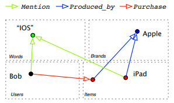

# Learning Heterogeneous Knowledge Base Embeddings for Explainable Recommendation

[CFKG: Learning Heterogeneous Knowledge Base
Embeddings for Explainable Recommendation](https://arxiv.org/pdf/1805.03352.pdf)

# 1. Introduction

**Contributions**

- Propose to integrate user behaviors and knowledge of the items into a KG for recommendation.
- Based on the user-item KG, extend the traditional CF to learn over the heterogenous knowledge for recommendation, helps to capture user preferences.
- Propose a soft matching algorithm to construct explanations by searching over the paths in the graph embedding space.
- Extensive experiments verify that thier model can outperform many state-of-the-art baselines on real-world e-commerce datasets.

# 2. Related Work

沒人做過knowledge base embedding for explainable recommendation.

# 3. Problem Formulation

- goal of *explainable product recommendation*:
    1. for each user $u$, find one or a set of items $i$.
    2. for each retrieved user-item pair, construct a natural language sentence based on KG to explain why the user should purchase the item.
- construct a KG as as set of triplets $\mathcal{S}={(e_h,e_t,r)}$
    - 5 types of entities:
        1. *user*
        2. *item*
        3. *word*: words int product name, descriptions or reviews
        4. *brand*
        5. *category*
    - 7 types of relations:
        1. *Purchase*: *user → item*
        2. *Mention*: *user → word* or *item → word*
        means the word is mentioned in the user's or item's reviews.
        3. *Belongs_to*: *item → category*
        4. *Produced_by*: *item → brand*
        5. *Bought_together*: *item → item*
        means that items have been purchased together in a single transaction.
        6. *Also_bought*: *item → item*
        items have been purchased by same users.
        7. *Also_viewed*: *item → item*
        means that second item was viewed before or after the purchse of the first item in a single session. 

# 4. Collaborative Filtering on Knowledge Graphs

## 4.1. Relation Modeling as Entity Translations

represent $e_h, e_t, r$ as latent vectors $\boldsymbol{e}_h, \boldsymbol{e}_t, \boldsymbol{r} \in \mathbb{R}^d$, and model thire relationship $r$ as a linear projection from $e_h$ to $e_t$ by:

$$\boldsymbol{e}_t = \operatorname{trans}(e_h,r) = \boldsymbol{e}_h + \boldsymbol{r} \tag{1}$$

Solving equation (1) for all $(e_h,e_t,r) \in \mathcal{S}$ is infeasible in practice.
For example, we cannot find a single vector for Also_viewed that translates an item to multiple items that have different latent representations.

Formally, for an observed triplet ${(e_h,e_t,r)} \in \mathcal{S}$, we can learn the translation model $\operatorname{trans}(e_h,r)$ by optimizing the generative probability of $e_t$ givin $\operatorname{trans}(e_h,r)$:

$$P\left(e_{t} \mid \operatorname{trans}\left(e_{h}, r\right)\right)=\frac{\exp \left(\boldsymbol{e}_{t} \cdot \operatorname{trans}\left(e_{h}, r\right)\right)}{\sum_{e_{t}^{\prime} \in E_{t}} \exp \left(\boldsymbol{e}_{t}^{\prime} \cdot \operatorname{trans}\left(e_{h}, r\right)\right)} \tag{2}$$

where $E_t$ is the set of all possible entities that share the same type with $e_t$.

## 4.2. Optimization Algorithm

### Objective function

Learn the representations of entities and relations by maximizing the likelihood of all observed relation triplets:

$$\mathcal{L}(\mathcal{S})=\log \prod_{\left(e_{h}, e_{t}, r\right) \in \mathcal{S}} P\left(e_{t} \mid \operatorname{trans}\left(e_{h}, r\right)\right) \tag{3}$$

where $\mathcal{S}$ is the observed triplets in the training data, $P\left(e_{t} \mid \operatorname{trans}\left(e_{h}, r\right)\right)$ is the posterior probability defined in (2).

Adopt negative sampling to approximate $P\left(e_{t} \mid \operatorname{trans}\left(e_{h}, r\right)\right)$, for each triplet $(e_h, e_t, r)$, randomly sample a set of negative entities with the same type of $e_t$. The log likelihood of $(e_h, e_t, r)$ is approximated as

$$\log P\left(e_{t} \mid \operatorname{trans}\left(e_{h}, r\right)\right) \approx \log \sigma\left(\boldsymbol{e}_{t} \cdot \operatorname{trans}\left(e_{h}, r\right)\right)+k \cdot \mathbb{E}_{e_{t}^{\prime} \sim P_{t}}\left[\log \sigma\left(-\boldsymbol{e}_{t}^{\prime} \cdot \operatorname{trans}\left(e_{h}, r\right)\right)\right] \tag{4}$$

where $k$ is the number of negative samples, $P_t$ is a predefined noisy distribution over entities with the type of $e_t$, and $\sigma$ is a sigmoid function. Therefore, $\mathcal{L}(\mathcal{S})$ can be reformulated as:(

$$\mathcal{L}(\mathcal{S})=\sum_{\left(e_{h}, e_{t}, r\right) \in \mathcal{S}} \log \sigma\left(\boldsymbol{e}_{t} \cdot \operatorname{trans}\left(e_{h}, r\right)\right) +k \cdot \mathbb{E}_{e_{t}^{\prime} \sim P_{t}}\left[\log \sigma\left(-\boldsymbol{e}_{t}^{\prime} \cdot \operatorname{trans}\left(e_{h}, r\right)\right)\right] \tag{5}$$

Authors also test $\ell_2$-norm loss used in TransE bust does nor provide improvement, and it is also difficulty for $\ell_2$-norm loss to generate expansions.

### Relationship with traditional CF method based on matrix factorization

local objective for Equation (5) on a specific relation triplet $(e_h,e_t,r)$:

$$\ell(e_h,e_t,r) = \#(e_h,e_t,r) + log\sigma(\boldsymbol{e}_t\cdot\operatorname{trans}(e_h,r)) + k \cdot \#(e_h,r) \cdot P_t(e_t) \cdot log\sigma(-\boldsymbol{e}_t\cdot\operatorname{trans}(e_h,r)) \tag{6}$$

where $\#(e_h,e_t,r)$ and $\#(e_h,r)$ are the frequency of $(e_h,e_t,r)$ and $(e_h,r)$ in the training data.

Partial derivative of $\ell(e_h,e_t,r)$ w.r.t. $x = \boldsymbol{e}_t \cdot \operatorname{trans}(e_h,r)$:

$$\frac{\partial \ell\left(e_{h}, e_{t}, r\right)}{\partial x}=\#\left(e_{h}, e_{t}, r\right) \cdot \sigma(-x)-k \cdot \#\left(e_{h}, r\right) \cdot P_{t}\left(e_{t}\right) \cdot \sigma(x) \tag{7}$$

When training process has converged, the partial derivative of $\ell(e_h,e_t,r)$ should be $0$,

and then have:

$$x = \boldsymbol{e}_{t} \cdot \operatorname{trans}\left(e_{h}, r\right)=\log \left(\frac{\#\left(e_{h}, e_{t}, r\right)}{\#\left(e_{h}, r\right)} \cdot \frac{1}{P_{t}\left(e_{t}\right)}\right)-\log k \tag{8}$$

The right hand side of Equation (8) is a shifted version of the pointwise mutual information between $e_t$ and $(e_h,r)$. Therefore

maximizing the log likelihood of observed triplet with negative sampling is actually factorizing the matrix of mutual information between the head-tail entity pairs.

# 5. Recommendation Explanation with Knowledge Reasoning

## 5.1. Explanation Path

Let $E_h^r$ and $E_t^r$ be the sets of all possible head entities and tail entities for a relation $r$.

define an explanation path from entity $e_u$ to entity $e_i$ as two sets of relation $R_\alpha= \left\{ r_\alpha | \alpha \in [1,m] \right\}$ and $R_\beta = \left\{ r_\beta | \beta \in [1,n] \right\}$ s.t.

$$\boldsymbol{e}_u + \sum_{\alpha=1} ^ m \boldsymbol{r}_\alpha = \boldsymbol{e}_i + \sum_{\beta=1}^n \boldsymbol{r}_\beta \tag{9}$$

where $e_u \in E_h^{r_\alpha}$ for $\alpha=1$, $e_h \in E_h^{r_\beta}$ for $\beta=1$, $E_t^{r_{\alpha-1}} = E_h^{r_\alpha}$ for $\alpha \in [2,m]$, $E_t^{r_{\beta-1}} = E_h^{r_\beta}$ for $\beta \in [2,n]$, and $E_t^{r_\alpha} = E_t^{r_\beta}$ for $\alpha=m, \beta=n$.

白話文: 分別從e_u、e_i開始出發走，找到碰頭的entitity，就形成一條explanation path.
→ 這樣應該就解決了需要把relation反過來資料變兩倍的問題

Example explanation paths between a user Bob and a recommended item iPad.

## 5.2. Entity Soft Matching

It is often difficult for finding a valid explanation path with observed relations for a n arbitrary user-item pair since product knowledge graphs tend to be sparse.

To solve the problem, this paper propose to conduct entity soft matching in the latent space for explanation construction. They extend the softmax function to compute the probability yo entity $e_x \in E_t^{r_m}$ given $e_u$ and the relation set $E_\alpha = \{ r_\alpha \mid \alpha \in [1,m] \}$ as

$$P\left(e_{x} \mid \operatorname{trans}\left(e_{u}, R_{\alpha}\right)\right)=\frac{\exp \left(\boldsymbol{e}_{x} \cdot \operatorname{trans}\left(e_{u}, R_{\alpha}\right)\right)}{\sum_{e^{\prime} \in E_{t}^{r_{m}}} \exp \left(\boldsymbol{e}^{\prime} \cdot \operatorname{trans}\left(e_{u}, R_{\alpha}\right)\right)} \tag{10}$$

where $E_t^{r_m}$ is the tail entity set of $r_m$, and $\operatorname{trans}(e_u, R_\alpha) = \boldsymbol{e}_u + \sum_{\alpha=1}^m \boldsymbol{r}_\alpha$.

Therefore, we can construct an explanation path for an arbitrary user and item with relation sets $R_\alpha = \{ r_\alpha \mid \alpha \in [1,m]  \}$ and $R_\beta = \{ r_\beta \mid \beta \in [1,n]  \}$ through intermediate $e_x \in E_t^{r_m}$, and compute the probability of this explanation path as:

$$P(e_x \mid e_u, R_\alpha, e_i, R_\beta) = P(e_x \mid \operatorname{trans}(e_u, R_\alpha)) P(e_x \mid \operatorname{trans}(e_i, R_\beta))$$

To find the best explanation for $(e_u, e_i)$, rank the $P(e_x \mid e_u, R_\alpha, e_i, R_\beta)$.

## Algorithm: Recommendation Explanation Extraction

- 從$e_u$出發，BFS尋找所有 $\leq z$ 的path $\mathcal{R}_e$、終點的entity $V_e$、path probability $P_u$
- 從$e_i$出發，BFS尋找所有 $\leq z$ 的path $\mathcal{R}_i$、終點的entity $V_i$、path probability $P_i$
- $V_u$、$V_i$取交集 (找出兩邊path終點相同的entity形成完整的explanation path)，
再分別計算這些explanation path的probability ($P_u \times P_i$)
- Output最大probability的explanation path

# 6. Experimental Setup

## 6.1 Datasets

- Amazon review dataset.
- use 5-core data of CDs and Vinyl, Clothing, Cell Phones, and Beauty
- filter each user or item has at least 5 associated reviews.
- randomly sampled 70% of user purchase as the training data and rest 30% as the test set.
➡️each user has at least 3 reviews in training and 2 reviews in test.

## 6.2 Evaluation

- baseline
    - traditional recommendation methods based on matrix factorization:
    BPR, BPR-HFT, VBPR
    - other deep models:
    TransRec, DeepCoNN, CKE, JRL
- metrics:
    - NDCG@10
    - Precision@10
    - Recall@10
    - HitRatio@10

## 6.3 Parameter Settings

- learning rate: 0.5 → 0.0
- batch_size: 64
- clip the norm of batch gradient: 5
- epochs: 20
- negative sampling number: 5
- dimension of embedding: [10,50,100,200,300,400,500]
- 5-fold cross-validation to tune the hyper-parameter

# 7. Results and Discussion

## 7.1 Recommendation Performance

### 1. RQ1: Does incorporating knowledge-base in our model produce better recommendation performance?

### 2. RQ2: Which types of product knowledge are most useful for top-N recommendation?

### 3. RQ3: What is the efficiency of our knowledge-enhanced recommendation model compared to other algorithms?

take comparable training time on the largest dataset (about 10 hrs).

generating the recommendation list for a particular user on largest CDs & Vinyl dataset requires less then 20 ms.

## 7.2 Case Study for Explanation Generation

3 explanation paths between user A1P27BGF8NA129 and item B009RXU59C (B9C).

1. (A1P27BGF8NA129) -[Purchase]→ (*) -[Bought_together]→ (BTU) ←[Bought_together]- (B9C)
2. (A1P27BGF8NA129) -[Purchase]→ (*) -[Bought_together]→ (BYS) ←[Bought_together]- (B9C)
3. (A1P27BGF8NA129) -[Purchase]→ (*) -[Belongs_to]→ (Chargers) ←[Belongs_to]- (B9C)

with confidence:

1. 27.80% × 26.57% = 7.39%
2. 5.48% × 3.41% = 0.19%
3. 2.53% × 30.90% = 0.78%

Details of each product in Fig.4:

- B9C: High-speed Wall Charger by New Trend for tablets
- BTU: iPad mini Keyboard Case
- BYS: iPad Air Keyboard Case

If the generated explanations are reasonable, this means that the user has purchased some items (*) that were frequently co-purchased with iPad accessories. Also, this indicates that there is a high probability that the user has an iPad.

# 8. Conclusion and Outlook

- construct the user-item knowledge graph to incorporate both user behaviors and knowledge about the items.
- devise a soft matching algorithm to find explanation paths between a user and the recommended items.