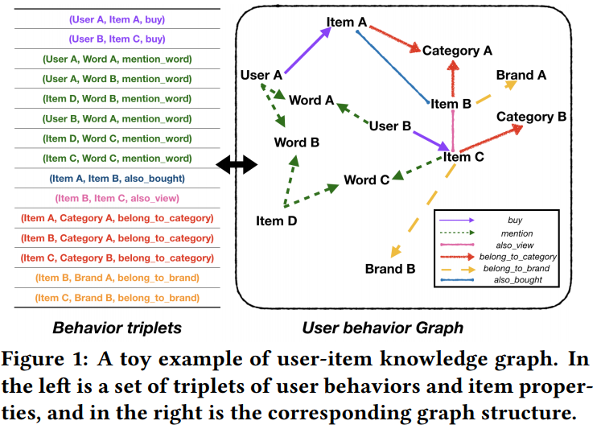

# Learning over Knowledge-Base Embeddings for Recommendation

[Learning over Knowledge-Base Embeddings for Recommendation](https://arxiv.org/pdf/1803.06540.pdf)

# 1 Introduction

**Main Contribution**
integration of traditional CF and knowledge base embedding technology.

# 2 Collaborative Filtering with Knowledge Graph

## 2.1 Model structure

Define a user-item knowledge-graph specialized for recommender systems
➡️ conduct collaborative filtering on this graph to provide personalized recommendations.

### 2.1.1 User-Item Knowledge Graph in Recommender System

Define 5 types of entities and 6 types of relations

- 5 types of entities:
    1. *user* 
    2. *item*
    3. *word*
    4. *brand*
    5. *category*

6 types of relations:

1. *buy*: *user → item*
2. *belong_to_category*: *item → category*
3. *belong_to_brand*: *item → brand*
4. *mention_word*: *user → word* or *item → word*

    meaning that the word is mentioned in the reviews of the user or item.

5. *also_bought*: *item → item*

    meaning that users who bought the first item also bought the second item.

6. *also_view*: *item → item*

    meaning that users who bought the first item also viewed the second item.

### 2.1.2 Collaborative Filtering based on User-Item Knowledge Graph

用TransE學所有entities跟relations的embedding

### 2.1.3 Personalized Recommendation

generate recommendations for the target user $e_u$ by ranking the candidate item $e_j$ in ascending order of the distance $d(trans_{e_{buy}}(e_u), e_j) = d(e_u+e_{buy}, e_j)$

# 3 Experiments

## 3.1 Experimental Setup

- Datasets

    Amazon e-commerce dataset, adopt four sun-datasets in terms of size and sparsity, which are CD, Clothing, Cell Phone, and Beauty.

    

- Evaluation Method

    Precision, Recall, Hit Ratio, NDCG

- Baselines
    1. BPR: The bayesian personalized ranking
    2. BPR_HFT: The hidden factors and topics model that leveraging textual reviews
    3. VBPR: visual bayesian personalized ranking that recommend with images
    4. DeepCoNN: A review-based deep recommender, leverages CNN to jointly model the users and items
    5. CKE: A neural recommender that integrates textual, visual information, and knowledge base for modeling
    6. JRL: The joint representation learning model, can leverage multi-model information for Top-N recommendation.
- Parameter settings
    - embedding randomly initialized in (0,1).
    - optimizer: SGD
    - learning rate: {1, 0.1, 0.01, 0.001}
    - model dimension: {10, 50, 100, 200, 300, 400, 500}
    - final learning rate and dimension: 0.01, 300
    - 70% items of each user are for training, remaining are for testing
    - generate Top-10 recommendation list for each user in test dataset.

## 3.2 Performance Comparison

CFKG好棒棒

## 3.3 Further Analysis on Different Relations

實驗KG上只有buy的資訊跟加入其他資訊的performance:

- 涵蓋多面向的資訊的確有助於推薦的performance
- KG的結構對推薦有優勢
    - *buy*跟BPR比 (都只用到購買資訊): *buy*贏
    - *buy+mention*跟BPR_HFT、DeepCoNN比 (都用購買跟評論的資訊): *buy+mention*贏